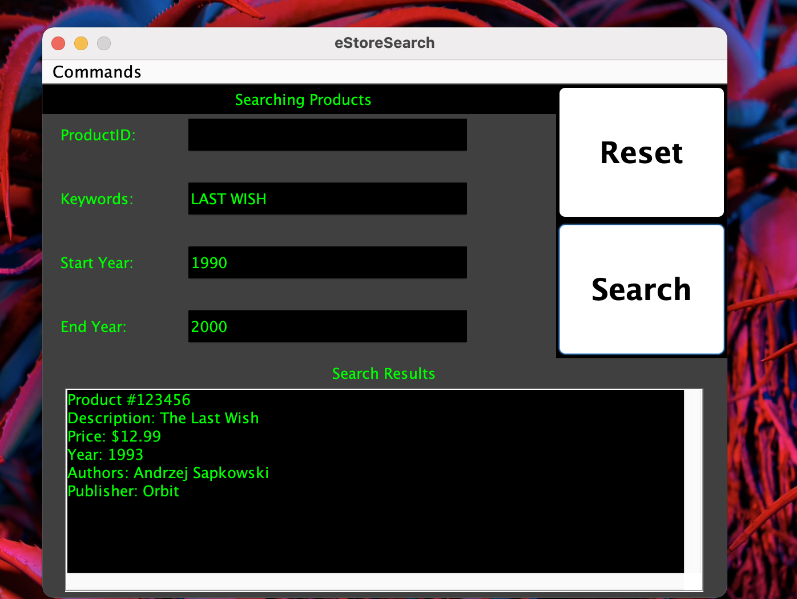

<!-- PROJECT Title -->
# eStore

<!-- ABOUT THE PROJECT -->
## About The Project
This academic project was created to simulate an "eStore" by using object oriented programming to represent two types of products (Books and Electronics). These products can be added to the eStore via an ArrayList, and a subset of products can be searched for in the eStore by also using ArrayLists. The details of these products, and the filters to search the store are both generated through user input via the command line.

# Demo


### Prerequisites

1. [Gradle must be installed](https://gradle.org/install/)

<!-- USAGE EXAMPLES -->
## Usage

```sh
gradle run --console=plain --args='<FILE_NAME>'  
 ```